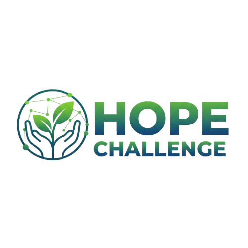

<div align="center">

  

# Fe Hope Challenges

  <p align="center">
    <b>Nền tảng Frontend hiện đại - Xây dựng với Next.js & TypeScript</b>
  </p>


  <br />

[Demo (Coming Soon)]() · [Báo lỗi]() · [Yêu cầu tính năng]()

</div>

---

## 📖 Giới thiệu

**Fe Hope Challenges** là một ứng dụng web frontend được tối ưu hóa, sử dụng sức mạnh của **Next.js 16** (App Router) kết hợp với **Ant Design** để tạo ra trải nghiệm người dùng mượt mà và giao diện hiện đại. Dự án tập trung vào khả năng mở rộng, hiệu suất và trải nghiệm lập trình viên tốt nhất với TypeScript.

## ✨ Tính năng nổi bật

- 🎨 **Giao diện hiện đại**: Sử dụng **Tailwind CSS v4** và **Ant Design** cho UI nhất quán và đẹp mắt.
- 🚀 **Hiệu suất cao**: Tối ưu hóa với Next.js 16 SSR/CSR và **Framer Motion** cho các hiệu ứng chuyển động mượt mà.
- 🔐 **Xác thực bảo mật**: Tích hợp đăng nhập Google (OAuth) và xử lý JWT.
- 📦 **Quản lý State mạnh mẽ**: Sử dụng **Zustand** cho state management nhẹ nhàng nhưng hiệu quả.
- 📝 **Form Handling**: Xử lý form chuyên nghiệp với **Formik** và **Yup**.

## 📸 Hình ảnh

<div align="center">
  
</div>

## 🛠️ Công nghệ sử dụng

| Công nghệ                                         | Mô tả                                          |
| ------------------------------------------------- | ---------------------------------------------- |
| **[Next.js 16](https://nextjs.org/)**             | Framework React full-stack mạnh mẽ.            |
| **[TypeScript](https://www.typescriptlang.org/)** | Static typing giúp code an toàn và dễ bảo trì. |
| **[Tailwind CSS](https://tailwindcss.com/)**      | Styling nhanh chóng, linh hoạt.                |
| **[Ant Design](https://ant.design/)**             | Bộ UI component chuyên nghiệp.                 |
| **[Zustand](https://zustand-demo.pmnd.rs/)**      | State management đơn giản, scalable.           |
| **[Axios](https://axios-http.com/)**              | HTTP Client.                                   |

## � Hướng dẫn cài đặt

Làm theo các bước sau để chạy dự án trên máy cục bộ của bạn.

### 1. Clone dự án & Cài đặt Dependencies

Yêu cầu **Node.js** phiên bản mới nhất.

```bash
# Cài đặt các gói thư viện
npm install
```

### 2. Thiết lập biến môi trường

Tạo file `.env.local` nếu cần thiết (dựa vào `.env.example` nếu có) để cấu hình các biến môi trường như API keys.

### 3. Chạy môi trường phát triển (Development)

```bash
# Khởi chạy server development tại cổng 3000
npm run dev
```

Truy cập [http://localhost:3000](http://localhost:3000) để xem kết quả.

## 📂 Cấu trúc dự án

```
d:\Projects\Fe_Hope_Challenges
├── app/                  # App Router & Page Components
│   ├── (main)/           # Main Layout Group
│   ├── components/       # Các component tái sử dụng
│   ├── lib/              # Utils, Types, Data giả lập
│   └── ...
├── public/               # Static assets (images, logos)
├── tailwind.css          # Global Styles
└── ...
```

## 🤝 Đóng góp

Mọi đóng góp đều được hoan nghênh! Vui lòng tạo Pull Request hoặc mở Issue để thảo luận về những thay đổi lớn.

---

<div align="center">
  <sub>Built with ❤️ by Fe Hope Challenges Team</sub>
</div>


kế hoạch
PHẦN 2: KẾ HOẠCH TRIỂN KHAI TƯƠNG LAI (ROADMAP) 🚀
Dưới đây là lộ trình bài bản để biến các bảng dữ liệu rời rạc thành một ứng dụng chạy được.

🔥 GIAI ĐOẠN 2: HỆ THỐNG TÀI CHÍNH & VÍ (Làm ngay tiếp theo)
Mục tiêu: Xử lý dòng chảy của Time-Credits. Không có tiền thì không book được lịch.

API Nạp/Rút giả lập: Admin tặng tiền (Bonus) cho user để test, hoặc User nạp tiền (giả lập).

Logic Chuyển tiền (Core): Viết hàm transfer_credits (A chuyển cho B) có tính chất Atomic (Giao dịch nguyên tử - A trừ thì B mới được cộng, lỗi là hoàn tác cả hai).

API Lịch sử giao dịch: Xem biến động số dư ("Tôi đã tiêu gì?").

⚡ GIAI ĐOẠN 3: GHÉP NHANH & REAL-TIME (Instant Match)
Mục tiêu: Tính năng "Uber cho việc học". Cần xử lý thời gian thực.

Cài đặt Socket.IO: Tích hợp Flask-SocketIO vào dự án.

Cơ chế Online/Offline: User bật nút "Sẵn sàng dạy" -> Server lưu trạng thái vào Redis hoặc Memory.

Luồng Matching:

Học viên bấm "Tìm người giúp Python".

Server tìm User có skill "Python" && đang Online.

Server bắn Socket thông báo tới Tutor.

Tạo Phiên (Session): Khi Tutor nhận kèo -> Tạo bản ghi MatchSession.

📚 GIAI ĐOẠN 4: KHÓA HỌC & LỘ TRÌNH (Structured Courses)
Mục tiêu: Học dài hạn, bài bản.

CRUD Khóa học: Tutor tạo khóa học, giá tiền, mô tả.

CRUD Giáo án (Syllabus): Tạo các buổi học (Session 1, Session 2...) trong khóa đó.

Đăng ký học (Enrollment):

Học viên bấm "Mua khóa học".

Hệ thống gọi module Tài chính (GĐ2) để trừ tiền Học viên, giữ tiền ở hệ thống (chưa trả ngay cho Tutor).

📹 GIAI ĐOẠN 5: TÍCH HỢP VIDEO CALL (Integration)
Mục tiêu: Kết nối hình ảnh/âm thanh.

Video Token Provider: Viết hàm Python sinh Token cho ZegoCloud hoặc Agora.

API Get Room: Khi 2 người vào phiên học -> Gọi API lấy RoomID và Token để Frontend mở camera.

⭐ GIAI ĐOẠN 6: ĐÁNH GIÁ & AN TOÀN (Trust & Safety)
Review System: Học xong -> Rating 5 sao -> Lúc này hệ thống mới chuyển tiền tạm giữ cho Tutor.

Reporting: Báo cáo vi phạm.